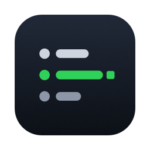
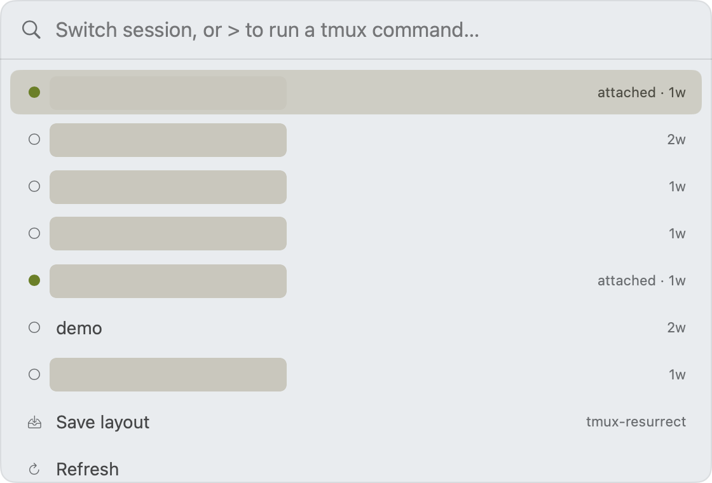

<p align="center">
  
</p>

<h1 align="center">Tmux Kit</h1>

<p align="center">
  A lightweight, native macOS app that gives <a href="https://github.com/tmux/tmux">tmux</a> a friendly GUI —
  manage sessions, windows, and panes without memorizing a single keybinding.
  <br>
  <strong>It doesn't replace tmux. It sits on top of the one you already use.</strong>
</p>

<p align="center">
  
  
  
</p>

---

## Why this exists

tmux is having a quiet renaissance. The same properties that made it great in 2007 — **session persistence, terminal multiplexing, detach/reattach over SSH, and tiny resource use** — turn out to be exactly what modern remote development and AI coding agents need. (Claude Code's multi-agent split panes, for instance, run on tmux.)

> *"Without tmux, a lost SSH connection kills every process you were running. With tmux, you reconnect, reattach, and continue where you left off."*

But tmux has one well-documented wall: **the keybindings.** `Ctrl-b "` to split, `Ctrl-b %` to split the other way, `Ctrl-b z` to zoom — none of it is discoverable, and newcomers usually end up with a cheat sheet taped to their monitor.

**Tmux Kit is that cheat sheet, made interactive — plus a GUI that does the work for you.** You keep tmux (and your config, your muscle memory, your remote servers); you just get a clean, native, point-and-click layer on top.

If you find Warp too heavy and you don't want to abandon tmux for a replacement multiplexer, this is for you.

## Features

- **Menu-bar quick switcher** — every session at a glance (green dot = attached), one click to switch.
- **Auto-focus the right window** — switching a session brings its terminal window to the front (via the Accessibility API); a detached session opens a fresh terminal window instead of hijacking your current one.
- **Command palette** (`⌥⌘T`, rebindable) — fuzzy-find and switch sessions from anywhere; type `>` to run any tmux command; type a new name to create a session on the spot.
- **Dashboard** — a 3-column browser (sessions → windows/panes → live pane preview) with an always-visible, labeled action bar: split, directional swap, break out, kill / kill-others, mark, clear history.
- **Interactive cheat sheet** — ~50 stock tmux shortcuts, searchable, click-to-copy. Keep it open while you learn; the clicks become the keystrokes you remember.
- **tmux console** — run any tmux command with presets and history (destructive commands ask first), with stdout/stderr shown.
- **Layout backup** — one-click save/restore via [tmux-resurrect](https://github.com/tmux-plugins/tmux-resurrect), if you have it.
- **Configurable global hotkeys** — bind the palette and "switch to recent session" to whatever you like.

## Screenshots

<!-- Drop curated screenshots in assets/screenshots/ and uncomment. Use a scratch
     tmux session for the Dashboard so private session names/paths don't ship here. -->
<!--
<p align="center">
  
  
</p>
<p align="center"></p>
-->

_Coming soon._

## Why not just…

| | Tmux Kit | [Warp](https://www.warp.dev) | [Zellij](https://zellij.dev) |
|---|---|---|---|
| What it is | A small GUI **on top of** tmux | A full terminal replacement | A tmux **replacement** multiplexer |
| Keeps your tmux | ✅ yes | — | ❌ replaces it |
| Footprint | Menu-bar resident, ~native | Heavier (Electron-class) | Light, but its own runtime |
| Account / sign-in | None | Required | None |
| Touches your config | **No plugins, no `~/.tmux.conf` changes** | n/a | New config format |

If you want AI features baked into a terminal, use Warp. If you want a modern multiplexer and don't need tmux's ubiquity over SSH, use Zellij. If you want to **stay on tmux** and just make it pleasant on macOS — Tmux Kit.

## Requirements

- macOS 14 (Sonoma) or later
- [`tmux`](https://github.com/tmux/tmux) (auto-detected; path is configurable in Settings)
- Any terminal. Window-focus matching is tuned for [Ghostty](https://ghostty.org) but the rest works everywhere.

## Install / Build

Not on the Mac App Store (the app is non-sandboxed: it runs `tmux` and uses the Accessibility API). Build it yourself — it's quick:

```sh
# prerequisites: Xcode, XcodeGen (brew install xcodegen), tmux
git clone https://github.com/semantic-craft/mac-tmux-kit.git
cd mac-tmux-kit
./scripts/build-app.sh        # builds, signs, installs to /Applications, launches
```

For development, `./scripts/run.sh` builds + re-signs + relaunches a Debug build.

> **First run:** grant **Accessibility** permission (Settings → Focus → *Open Accessibility Settings*) so Tmux Kit can bring terminal windows forward. The build is signed with your local Apple Development certificate, so the permission persists across rebuilds.

## Privacy & footprint

No network. No telemetry. No account. It talks only to your local `tmux` server and (optionally) brings terminal windows to the front. It never installs tmux plugins or edits your `~/.tmux.conf`. The single optional config touch — *Install recommended title format* — is a button you press, never automatic.

## Architecture (for contributors)

Native **SwiftUI + AppKit**, menu-bar resident (`LSUIElement`). Layering: `UI → Actions → Services (Tmux / Ghostty / Hotkeys) → Domain`. The project is generated from `project.yml` by [XcodeGen](https://github.com/yonaskolb/XcodeGen) (the `.xcodeproj` is git-ignored). The pure logic — domain models and the tmux `-F` output parser — lives in the `Core/` Swift package and is unit-tested headlessly (`cd Core && swift test`). Design system: see [`DESIGN.md`](DESIGN.md).

## Roadmap

- A cheat-sheet **practice mode** (drills, not just lookup)
- More bindable actions in the palette and as global hotkeys
- App icon polish, Sparkle auto-update, and Developer ID notarization for sharing across Macs
- Better tab-level focus within a single terminal window

## License

[MIT](LICENSE).

---

<p align="center">
  Built for people who like their setup <em>clean</em>. If that's you, leave a ⭐.
</p>
